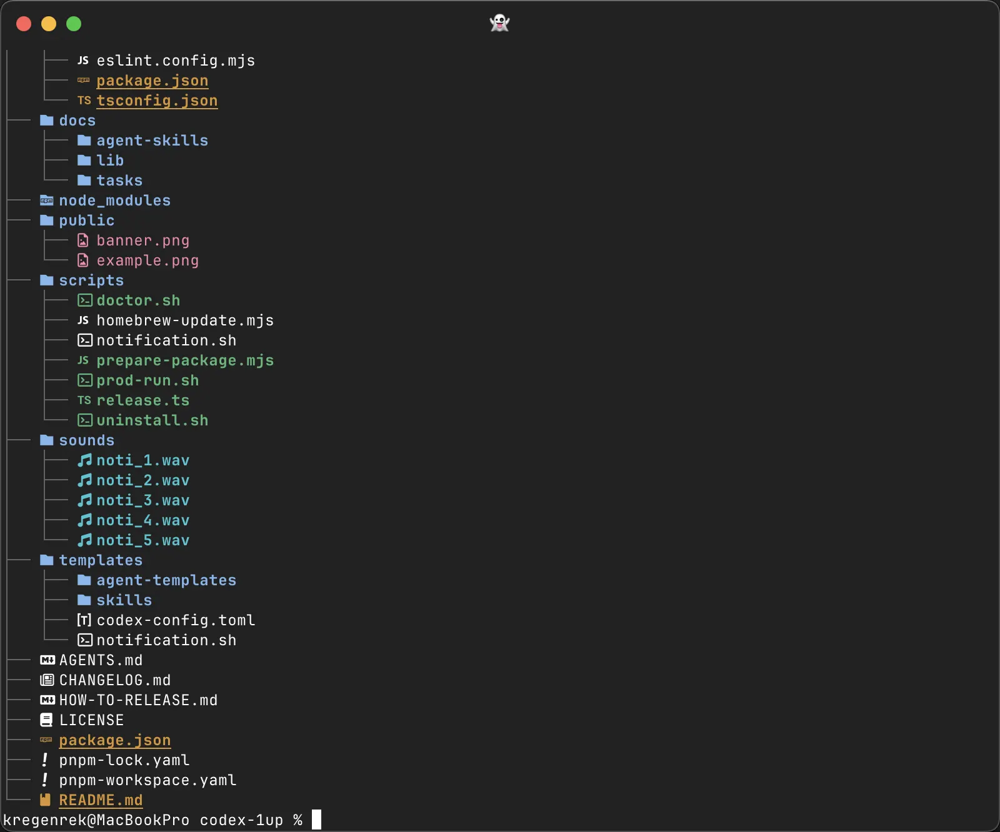
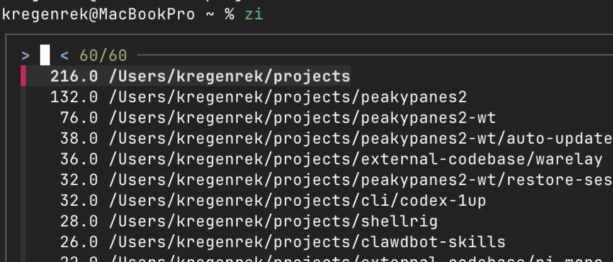

# shellrig

Fast shell tools for navigating projects, wrangling git, and staying in flow.


- **Jump anywhere** — fuzzy-find files (`co`) and projects (`pr`) with instant previews
- **GitHub shortcuts** — search, pick, and clone repos without leaving the terminal (`gpick`, `gclone`)
- **Pretty diffs** — readable git diffs via delta (`gdelta`)
- **Quick commits** — `git cmp "message"` stages everything and pushes in one shot
- **Clipboard → Markdown** — paste a screenshot, get a webp + markdown link (`mdclip`)

## Install

```bash
git clone git@github.com:regenrek/shellrig.git ~/projects/shellrig
```

Then add to your PATH and source the zsh plugin → [full install guide](docs/install.md)

## Screenshots (clipboard -> markdown)

macOS: save clipboard screenshot into `public/` and copy Markdown to clipboard:

```bash
brew install pngpaste webp
mdclip
```

More: `docs/mdclip.md`.

## Commands

### `co` — open files (fzf + preview)

Quickly open any file in your editor when you roughly know the name but not the path.

```bash
co <query>        # filtered to "code-ish" files
co -a <query>     # all files
```


### `pr` — jump to a repo

Instantly `cd` into any project folder without typing long paths.

```bash
pr <query>
```


### `cwd` — print repo path

Get the full path to a project for use in scripts or other commands.

```bash
cwd <query>
```


### `gpick` — pick a GitHub repo

Search GitHub and interactively pick a repo when you can't remember the exact `owner/repo`.

```bash
gpick <search terms>
```


### `gclone` — clone a GitHub repo

Clone any repo by searching for it — no need to open a browser or copy URLs.

```bash
gclone <search terms|owner/repo>
gclone --ex <search terms|owner/repo>  # print SSH clone URL
gclone --p <search terms|owner/repo>   # print owner/repo
```


### `gdelta` — pretty diffs

Review changes with syntax highlighting and side-by-side view before committing.

```bash
gdelta
gdelta staged
gdelta -- --stat
```


### `mdclip` — clipboard screenshot -> Markdown

Turn a screenshot on your clipboard into a compressed webp and ready-to-paste markdown link.

```bash
mdclip
mdclip feature-x
```


### `ls` / `ll` / `lt` — listings (eza)

Better directory listings with icons, git status, and tree views.

```bash
ls
ll
lt
```



### `zi` — zoxide

Jump to frequently used directories without typing full paths — zoxide learns where you go.

```bash
zi
```



## Usage

```bash
shellrig list
shellrig hello

# zsh plugin
gdelta --help
gclone --help
gpick --help
co --help

# project
pr <query>   # cd into project root
cwd <query>  # prints project root

# open files
co <query>        # filtered to “code-ish” files
co -a <query>     # all files
```

## Homebrew Tools

Suggested installs:

```bash
brew install bat micro eza fd ripgrep fzf git-delta gh jq tmux shellcheck
```

What they’re used for:

- `bat`: previews in `co` (fallback to `sed` if missing)
- `micro`: default `$EDITOR` for `co`
- `eza`: `ls/ll/la/lt` aliases
- `fd`: file search backend for `co`, `cwd`, `pr`
- `ripgrep` (`rg`): general-purpose fast search (optional; not required by current `shellrig` functions)
- `fzf`: interactive picker UI for `co`, `gpick`, `cwd`, `pr`
- `git-delta` (`delta`): pager for `gdelta`
- `gh`: GitHub integration for `gpick`/`gclone`
- `jq`: JSON parsing for `gpick`
- `tmux`: `tks` alias
- `shellcheck`: lint (`make lint`)

Optional:

- `zinit` (`zi`): zsh plugin manager (if you want to manage `shellrig` + other plugins via `zi`)

## Git Tools

These are zsh functions + global git aliases (not `bin/` scripts), so keep them in the zsh plugin.

```bash
# zsh functions (from `source "$XDG_CONFIG_HOME/zsh/shellrig.zsh"`)
gdelta [staged|-- <git diff args>]      # pretty diff via delta
gpick <search terms>                    # repo picker (gh search + fzf)
gclone [--p|--ex] <terms|owner/repo>    # clone helper (gh search + git clone)

# git “external subcommands” (executables on PATH)
git new <branch>                         # runs `git-new` (create branch + push -u origin)
git cmp <commit message>                 # runs `git-cmp` (add -A + commit + push)
```

Notes:

- All of these can change remotes / push / clone; treat them as “power tools”.
- `git cmp` stages **everything** (`git add -A`) including deletions.

Migration:

- If you previously had `alias.new` / `alias.cmp` in `~/.gitconfig`, remove them so `git` uses the executables:
  - `git config --global --unset alias.new`
  - `git config --global --unset alias.cmp`

## Dev

```bash
make lint
make test
```

## ChezMoi

Use `chezmoi` to keep dotfiles private, and pull `shellrig` as an external repo. See `docs/chezmoi.md`.
